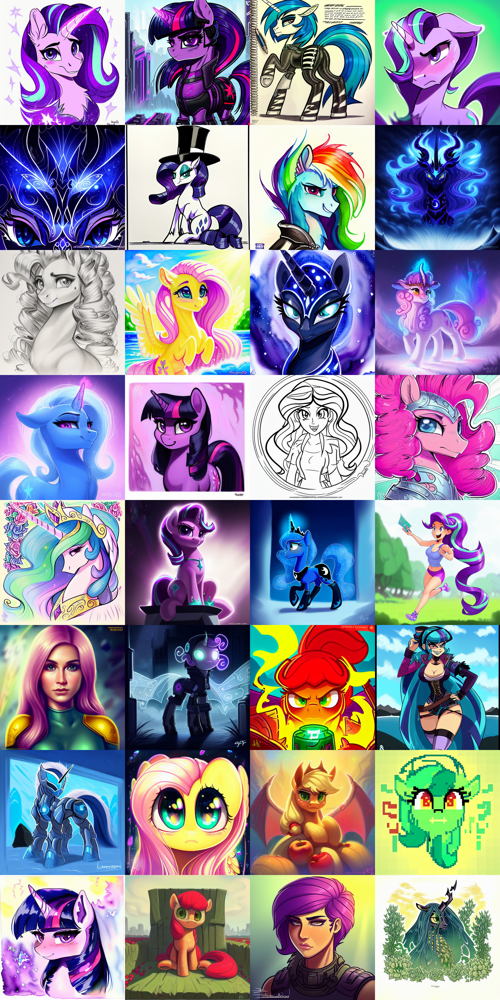
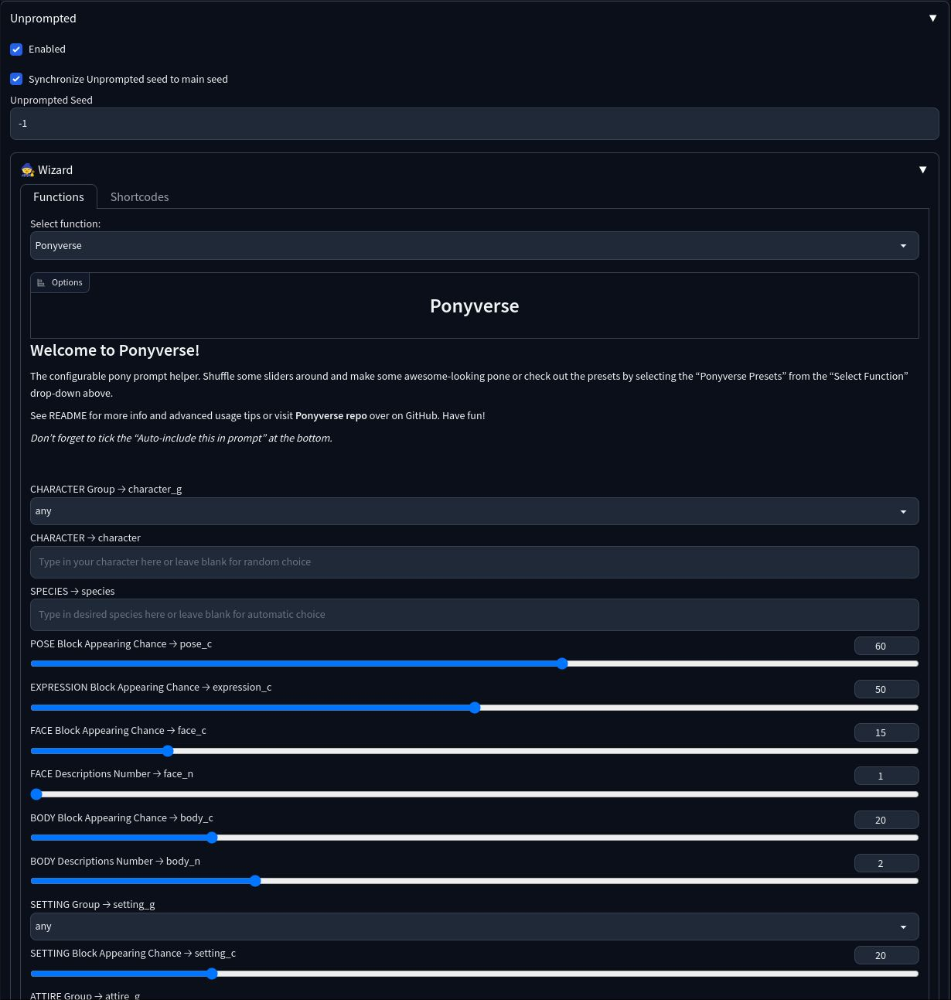
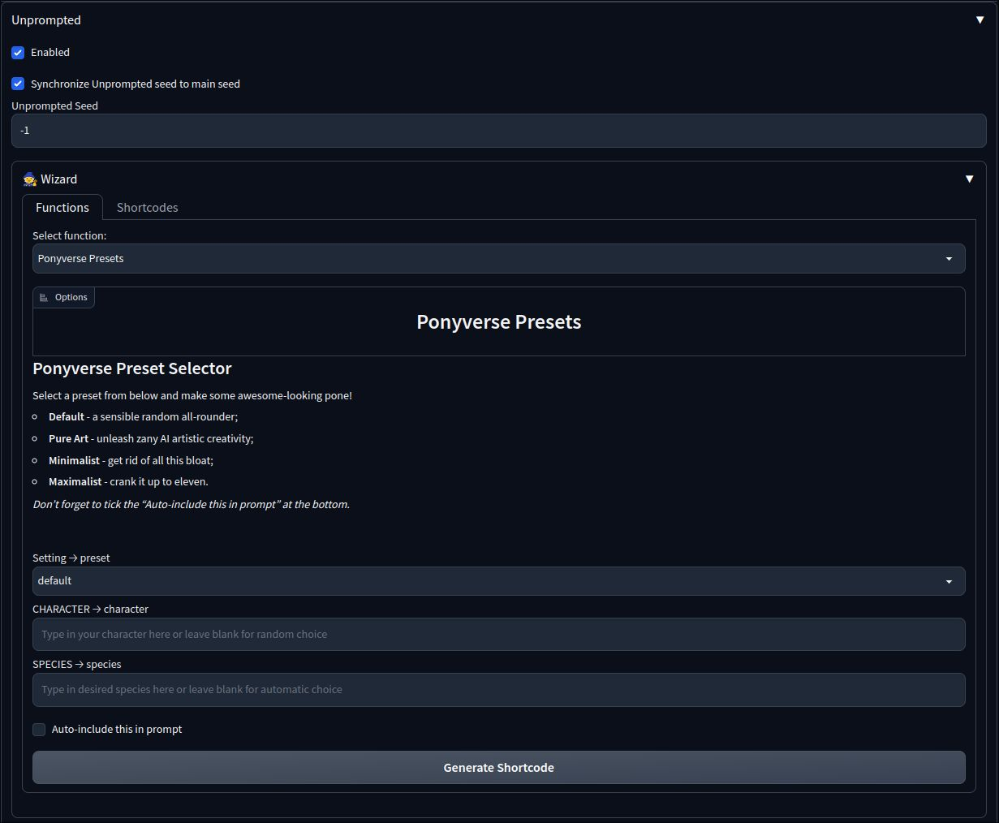

# Ponyverse
The configurable dynamic pony prompt helper for [AUTOMATIC1111's Stable Diffusion Web UI](https://github.com/AUTOMATIC1111/stable-diffusion-webui) inspired by [Ponymaster](https://github.com/ZealousMagician/Ponymaster). Comes with a very handy GUI and a number of presets that allow anyone to create some awesome-looking pone!



All images generated with the default Ponyverse preset.

## Installation

### Requirements
* [AUTOMATIC1111's Stable Diffusion Web UI](https://github.com/AUTOMATIC1111/stable-diffusion-webui);
* [Unprompted](https://github.com/ThereforeGames/unprompted) extension;
* *(optional)* [AstraliteHeart's V4 Pony Diffusion](https://huggingface.co/AstraliteHeart/pony-diffusion-v4). While Ponyverse should work relatively well on any tag-based pony model, its thesaurus and especially default negative promt were tuned specifically for Astra's V4.

### Manual
Clone this repository with
```
git clone https://github.com/Siberpone/ponyverse
```
or click the "code" button in the top right, then click "Download ZIP" and unzip the downloaded archive. After that move the "pv" folder to:
```
.../stable-diffusion-webui/extentions/unprompted/templates
```

## Usage
Ponyverse prompt is contructed form individualy configurable thematic blocks that are arranged one after another. Each block will generate a random description or a phrase, that reflects its subject or theme. For example, the "attire" block will generate character's attire description like "wearing socks" or "wearing dress". There are 4 main ways you can use these blocks to construct your prompt, that are described below.

> **Note**
>
> Ensure that the Unprompted extension is enabled.

### Unprompted Wizard
This is the prefered method as it provides a handy GUI for Ponyverse. You can expose it by opening the "Unprompted" fold in the Web UI's left panel and then opening the "Wizard" fold. After that, select "Ponyverse" from the "Select Function" drop-down and that should reveal the GUI, as shown in the screenshot below:



From here you can tweak various Ponyverse prompt parameters. Each UI input controls a certain parameter of a block and has a short annotation, that clarifies its intent. The blocks will appear in prompt in the same order as they appear in the UI and usually can be configured with the following parameters:

* **chance** - chance that the block will appear in the prompt. Set to 0 to disable the block; set to 100 to always include the block;
* **number** *(for some blocks)* - how many descriptions should the block generate;
* **group** *(for some blocks)* - narrow generated description down to that thematic group.

The exceptions to that are character, species and negative prompt (see below). Character and species blocks can be overriden by typing your values into the corresponding textboxes.

After you've tweaked the parameters to your liking, navigate to the bottom of the Wizard fold and tick the "Auto-include this in prompt" an hit "Generate" to make some awesome-looking pones!

#### Negative Prompt Handling
By default Ponyverse includes its own negative prompt, tuned specifically for Astra's V4. The tuning was aimed at weeding out model's sfm and furry/anime bias and make ponies look more like actual ponies. You can customize how Ponyverse handles negative prompt by typing your additions in the "Your Negative Prompt" textbox and selecting one of the following modes:

* **use_mine** - only "Your Negative Prompt" will be used;
* **append** *(default)* - "Your Negative Prompt" will be appended to the Ponyverse's negative prompt.
* **blank** - Ponyverse won't be affecting the negative prompt. Standard Web UI's negative prompt textbox will work normally.


#### Saving Your Presets
You can save your Ponyverse settings by navigating to the bottom of the Wizard fold and clicking the "Generate Shortcode" button. The text string that will appear underneath is your preset. Save it somwhere in a text file, for example, for future use (see [Directly In The Prompt Textbox](#directly-in-the-prompt-textbox)). I know this is inconvinient, but, unfortunately, Unprompted doesn't expose any mechanism to save/load these programmatically. You can somewhat mitigate that by adding your preset to the Ponyverse Preset Selector (see below).

### Preset Selector
Ponyverse Preset Selector allows you to run a number of pre-defined presets and, optionally, specify a character and species. To expose its interface, select the "Ponyverse Presets" from the "Select Function" drop-down in the Unprompted Wizard fold:



Select the desired preset, tick the "Auto-include this in prompt" and hit "Generate" to make some awesome-looking pones!

> **Note**
>
> Character and species overrides will have no effect if they are already specified in the chosen preset.

#### Adding Your Presets
Unfortunately, there's currently no way to add custom presets, other than manually editing the `preset.txt` file. To add your preset called, say "muh_fetish", you must do the following:
1. Open the `preset.txt` file with a text editor of your liking;
2. Locate the following line:
```
[set preset _new _choices="default|pure_art|minimalist|maximalist" _ui="dropdown"]default[/set]
```
3. Add your chosen preset name to the "_choices" attribute like so:
```
[set preset _new _choices="default|pure_art|minimalist|maximalist|muh_fetish" _ui="dropdown"]default[/set]
```
4. Append the following code to the end of the file:
```
[elif preset="muh_fetish"]
[/elif]
```
5. Paste your preset string (see [Saving Your Presets](#saving-your-presets)) inbetween the [elif] blocks from step 4:
```
[elif preset="muh_fetish"]
	[file "pv/main" character_g=any pose_c=60 expression_c=50 face_c=15 face_n=1 body_c=20 body_n=2 setting_g=any setting_c=20 attire_c=20 generic_c=85 generic_n=3 scenery_g=any scenery_c=15 scenery_n=1 medium_g=any medium_c=75 style_g=any style_c=45 np_mode=append]
[/elif]
```

And that's it! "muh_fetish" should now be selectable from the "preset" drop-down (if your ui was running, it will only appear after restart).

> **Warning**
>
> This file will be overwritten upon updating, so it's a good idea to copy it someplace else.

### Directly In The Prompt Textbox
This is more of a CLI style method. The simplest use case would be to just type `[file pv/main]` into the Web UI's prompt textbox. That will randomly choose a character and generate a prompt with the default Ponyverse preset. You can customise various aspects of Ponyverse's behavior by passing variables like so:
```
[file pv/main character="twilight sparkle" species="unicorn, pony" pose_c=35 setting_g=scifi generic_n=4]
```
This sets the character to Twilight Sparkle; species to "alicorn, pony"; pose block appearing chance to 35%; setting block thematical group to "scifi" and generic block repeat number to 4. See [Blocks](#blocks) section for all available variables.

### Using Individual Blocks With Your Prompt
Blocks can be injected into your own prompt direclty in the prompt textbox:
```
[file pv/get/character] wearing a funny hat
```
```
trixie trotting in the fields, unicorn, solo, [file pv/get/generic n=3], derpibooru_p_95
```
```
starlight glimmer, [file pv/get/pose], [file pv/get/scenery g="weather"]
```

## Blocks
Soon&trade;

## Changelog
#### 2023-03-31
* **Breaking Change** Reworked blocks API to be more concise. See updated [examples](#using-individual-blocks-with-your-prompt).
